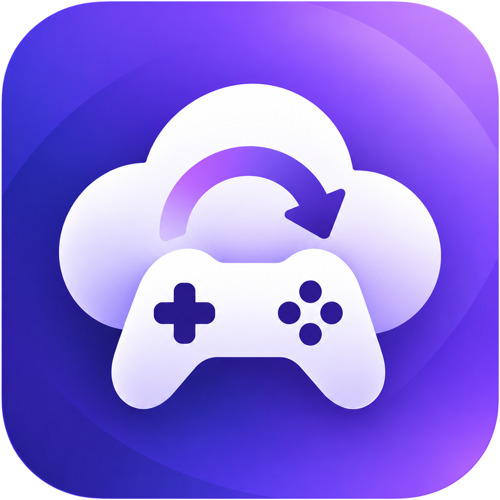

<div align="center">



# GameSave Go

本地优先的游戏云存档备份与设备同步工具。

</div>

> **Windows 正式版：v1.2.1。** 请从本仓库的 [GitHub Release](https://github.com/lyx5710317/gamesave-go/releases/tag/v1.2.1) 下载。GitHub Actions 的候选构建不是正式安装包；本次没有发布经过同等验证的 Linux 或 Steam Deck 安装包。

GameSave Go 基于开源项目 OpenSave 开发。它不要求注册 GameSave Go 账户；游戏存档保存在本机、你选择的云存储，或与你配对的设备上。使用坚果云、Google Drive 等服务时，仍需拥有相应服务的账户。

## 目前可以做什么

- **管理存档位置**：自动扫描常见游戏和模拟器的存档，也能手动添加一个文件或文件夹。一个游戏有多个存档位置时，可在游戏详情中分别配置。
- **保存本地历史**：监测已跟踪存档的变化并创建快照，也可以手动创建。可查看快照、恢复整个存档或其中的文件，并用分支保留不同游玩进度。
- **在设备间同步**：两台设备可在局域网发现、配对并同步；不同网络可使用房间码和中继。发生不确定的冲突时需要选择保留本机、对方或双方版本，不应按修改时间自动覆盖。
- **备份到自己的存储**：可选择坚果云、Google Drive、本地文件夹、其他 WebDAV 或 HTTP Webhook。云端快照可以浏览、只读验证；支持读取的目标可在确认后恢复。各提供商的能力和限制见下文。
- **查看运行状态**：游戏、云备份、活动和设置页面分别用于管理存档、查看传输结果及调整同步行为。界面支持简体中文和英语。
- **查找修改器**：游戏详情中的“查找修改器”先通过 Steam 应用编号、本地名称资料及常见中文名对应关系识别英文名；其他中文标题会尝试 Steam 官网精确搜索，只有唯一匹配才采用。随后在系统浏览器打开 FLiNG 搜索，由你选择对应版本下载。未能识别时，可输入英文名或在游戏配置中补充 Steam 应用编号后重试。

## 从软件界面开始

1. 在首页点击“自动扫描”，核对找到的存档位置；如果没有找到，点击“添加文件夹”手动选择。测试时请先使用不含真实游戏进度的文件。
2. 打开游戏详情，可手动创建快照、查看本地快照列表、设置额外存档位置和排除规则。恢复前先关闭游戏，确认所选快照确实含有需要的文件。
3. 要备份到云端，进入“云备份”，选择目标，填写配置，打开“启用云备份，并自动镜像新快照”，然后点击“保存设置”。这个开关同时控制云端浏览、上传、恢复和新快照的自动上传；关闭不会删除已有配置或备份。
4. 云端已有快照时，从“云备份 → 浏览云端”选择“验证”或“恢复”。游戏详情里的**本地快照列表不会自动下载云端文件**。只读验证会下载快照并消耗云盘流量，但不会恢复或覆盖存档。
5. 要连接另一台电脑，点击首页的“添加设备”，在“设备”页面配对。局域网设备可自动发现，也可按 IP 添加；跨网络使用房间码。另一台设备的存档路径可能不同，需在本机核对并配置映射，不要把真实存档指向测试目录。请按[两台设备连接与存档同步教程](docs/DEVICE_SYNC_GUIDE.md)先用测试文件完成一次双向验证。

替换当前存档前，程序会尝试创建并验证安全快照；如果无法证明备份成功，应停止恢复。安全检查可以降低误操作风险，但不构成对断电、磁盘故障或同时写入的绝对保证。

## 云备份现状

| 目标 | 当前用途与限制 |
| --- | --- |
| **坚果云（推荐）** | 使用官方 WebDAV 地址，快照放在独立的 `GameSaveGo/` 目录。当前按谨慎备份模式使用：上传、浏览、验证和恢复已有测试记录；远端存档库加入、祖先关系和强条件写入尚未完成。 |
| **Google Drive** | 可选择并授权，当前同样只按备份模式使用。Google Drive 允许同名对象。 |
| **本地文件夹** | 可选择本机目录或已挂载的 NAS 目录作为备份目标。目标盘不可用、权限不足或空间不足时，备份仍可能失败。 |
| **其他 WebDAV** | 保留为高级选项；服务端对不覆盖写入等条件的支持需要按实际提供商验证。 |
| **HTTP Webhook** | 向用户指定的地址上传快照；它不是通用的可浏览、可恢复云盘，也不提供已验证的无覆盖保证。 |
| **百度网盘、OneDrive、Dropbox** | 新配置入口暂时隐藏，已有代码和已保存配置未删除。 |

### 使用坚果云

在“云备份”选择“坚果云（推荐）”，填写**坚果云注册邮箱**和在坚果云“第三方应用管理”中单独生成的**第三方应用密码**，不要填写坚果云登录密码。官方基础地址会自动填写为 `https://dav.jianguoyun.com/dav/`，程序使用独立的 `GameSaveGo/` 远端目录。保存设置并启用云备份后，新快照会尝试自动上传；既有快照可在游戏详情中手动上传。

Windows 版将坚果云应用密码保存在当前用户的 Windows 凭据管理器中，设置页面只显示“已配置”，不会回显密码。每台设备都需要自行配置可用凭据。免费账户有流量和请求次数限制；程序按默认 **500 MB 单文件上限**预检上传。坚果云目录一次返回 **750 项**或出现不明分页状态时，当前实现会停止使用可能不完整的清单，不会假装远端为空或继续无冲突上传。详见[坚果云设计与发布门槛](docs/JIANGUOYUN_PROVIDER.md)。

### 云端恢复与设备同步不是一回事

“浏览云端”“验证”和“恢复”用于人工查看或取回备份。只读验证检查下载的 ZIP、清单大小，并在本机存在同名快照时比较字节；它**不能证明两台设备的存档历史相同**。恢复前仍须通过本机安全快照检查。

当前没有开放基于远端 `vault.json` 的生产级设备加入与多设备写入，也没有完成云端祖先判断和冲突解决。两台设备分别上传到同一云目录时，不要把“能看到文件”理解为可自动合并的同步状态。使用设备间实时同步，请走“添加设备”配对流程；跨互联网的中继连接加密只覆盖到中继，**不是端到端加密**，中继运营者可能读取传输内容。

## 下载、校验与从源码构建

**正式下载：**在 [GameSave Go v1.2.1 Release](https://github.com/lyx5710317/gamesave-go/releases/tag/v1.2.1) 下载 `GameSaveGo.Setup.exe`（Windows 安装包）或 `GameSaveGo.exe`（便携版），并下载同页的 `SHA256SUMS` 核对文件。上游 OpenSave 网站、安装脚本及其发布页提供的不是 GameSave Go；GitHub Actions 候选文件仅供测试，不是正式安装包。

由于个人开源项目暂未购买商业代码签名证书，**Windows 可能出现 SmartScreen 提示**。未签名安装包没有 Windows 已验证发布者身份；如果设备策略阻止运行，不要关闭安全防护强行安装。本次发布提供每个安装文件的 `SHA256SUMS` 和 GitHub Artifact Attestations。散列用于核对下载文件，来源证明用于核对构建仓库和提交；两者都不能保证软件没有漏洞，也不能替代 Windows 代码签名。

需要自行构建当前源码时，在 Windows 上准备 Go **1.26.6 或更新版本**、Node.js **22.12 或更新版本**和 Wails **2.12.0**。在仓库根目录运行：

```powershell
go install github.com/wailsapp/wails/v2/cmd/wails@v2.12.0
$env:Path += ";$(go env GOPATH)\bin"
Set-Location cmd/opensave-app/frontend
npm ci
Set-Location ..
wails build
```

开发构建输出位于 `cmd/opensave-app/build/bin/GameSaveGo.exe`。它不是经过正式发布流程验证的安装包。需要制作本地 NSIS 测试安装器时还要安装 NSIS，再运行 `wails build -nsis`。

下载后，可将文件散列与同一 Release 中的 `SHA256SUMS` 对照，并核验构建来源，例如：

```powershell
Get-FileHash -Algorithm SHA256 '.\GameSaveGo.Setup.exe'
gh attestation verify '.\GameSaveGo.Setup.exe' -R lyx5710317/gamesave-go
```

## 数据、隐私与兼容性

- 默认数据目录是当前用户的 `~/.opensave/`，在 Windows 通常位于 `%USERPROFILE%\.opensave\`。其中的 `opensave.db` 保存游戏与设置，快照和安全备份位于配置的存储目录；可在“设置 → 存储”查看或调整。迁移自旧版 OpenSave 的内部目录、数据库、协议和命令行名称继续保留，以免破坏已有数据和设备配对。
- GameSave Go 不提供自己的存档账户或托管存档服务器。启用云备份后，快照会传到你选定的目标；设备间同步也会传输存档内容。不要把测试凭据、真实存档或云服务密钥提交到仓库或问题报告中。
- Windows 桌面版的语言可在“设置 → 常规”选择简体中文或英语。安装器的语言在安装时单独选择。
- 继承的命令行程序名为 `opensave`。其旧版 `opensave update` 命令仍面向上游 OpenSave，**不要用它更新 GameSave Go**。仓库中的旧版网页文档也不是 GameSave Go 的官方下载站。

## 开发与文档

提交代码前，请先阅读 [AGENTS.md](AGENTS.md)、[产品规格](SPEC_V2.md)与[任务表](TASKS.md)。本地验证命令：

```powershell
go test ./...
Set-Location cmd/opensave-app/frontend
npm test
npm run build
Set-Location ..
wails build
```

更多边界与安全说明：[云端归档安全](docs/CLOUD_ARCHIVE_SAFETY.md)、[坚果云 WebDAV](docs/JIANGUOYUN_PROVIDER.md)、[远端 Vault 身份设计](docs/VAULT_IDENTITY_V2.md)、[发布准备](docs/RELEASE_V1_1.md)。

项目采用 [MIT 许可证](LICENSE)，保留原 OpenSave 作者、Go 重写及后续贡献者的版权信息；第三方说明见 [NOTICE.md](NOTICE.md)。
